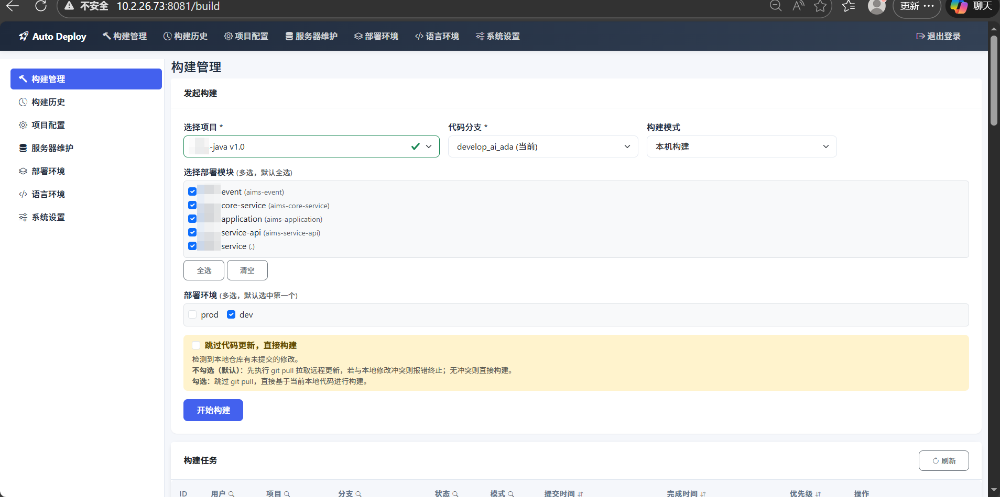
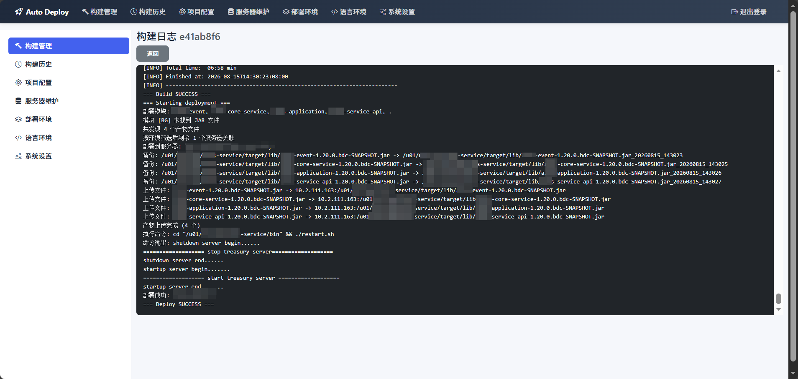
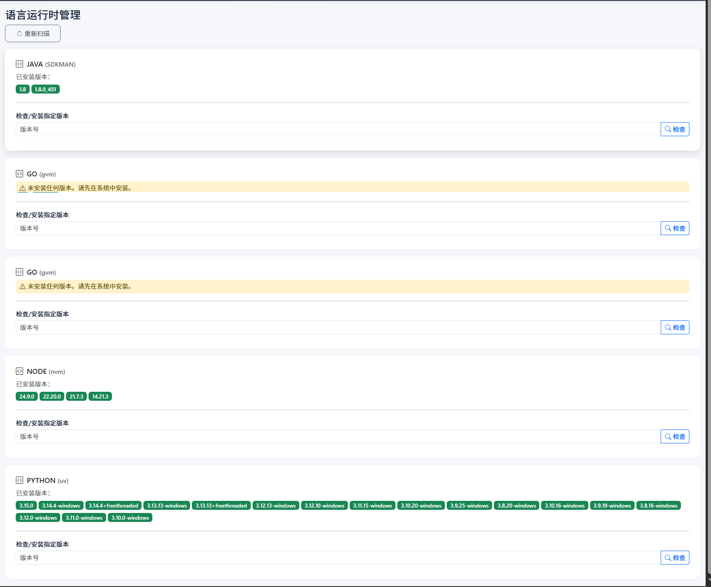

# Auto-Deploy

自托管的轻量级 CI/CD 系统，面向中小团队的持续集成与持续部署场景。

## 适用场景
- 初衷：主要解决非联网服务器部署。包括：军工、政务、新能源电厂等要求隔离互联网的行业
- 也适用于中小团队，可连接互联网的服务器部署

## 功能特性

- **代码拉取** — 支持 GitHub / GitLab / Gitee 等 Git 仓库，HTTPS Token 或 SSH 认证
- **多语言构建** — Java、Go、Node.js、Python 自动编译打包
- **远程部署** — 通过 SSH 自动上传构建产物到远程服务器并执行重启命令
- **实时日志** — 基于 SSE 的构建日志实时推送
- **多环境支持** — 开发、测试、生产等多环境多服务器的矩阵式部署拓扑
- **构建队列** — 优先级队列调度，支持并行构建（Git Worktree 隔离）
- **运行时管理** — 语言运行时版本检测与切换（Windows 本地扫描 / Unix SDKMAN/gvm/nvm/uv）
- **密钥安全** — 密钥仅存于环境变量，数据库只保存变量名引用
- **待完善功能**：
  - 支持容器服务部署
  - 基于事件监听代码提交

## 技术栈

| 层级 | 技术 |
|------|------|
| 后端框架 | Spring Boot 2.7.18 |
| 模板引擎 | Thymeleaf |
| ORM | MyBatis-Plus 3.5.5 |
| 数据库 | MySQL 8.0+（Flyway 自动迁移） |
| 认证 | Apache Shiro（Session 持久化到 JDBC） |
| Git | JGit 5.13.3 |
| SSH | Apache MINA SSHD 2.9.2 |
| 前端 | Bootstrap 5 + jQuery |

## 前置条件

- **JDK 8+**
- **Maven 3.6+**
- **MySQL 8.0+**

## 快速开始

### 1. 创建数据库

```sql
CREATE DATABASE auto_deploy DEFAULT CHARACTER SET utf8mb4;
```

### 2. 配置环境变量

```bash
# MySQL 密码（默认 root）
export MYSQL_PASSWORD=your_password
```

### 3. 构建并运行

```bash
mvn clean package
java -jar target/auto-deploy.jar
```

或直接使用 Maven 运行：

```bash
mvn spring-boot:run
```

### 4. 访问系统

浏览器打开 `http://localhost:8081`，注册账号后即可使用。

## 使用流程

1. **创建部署环境** — 定义环境名称（如"生产环境"、"测试环境"）
2. **添加服务器** — 配置服务器 IP、SSH 端口、认证信息（通过环境变量引用）
3. **配置项目** — 填写 Git 仓库地址、分支、语言类型、构建命令、部署脚本等
4. **触发构建** — 系统自动拉取代码 → 编译构建 → 上传产物 → 执行重启

## 界面预览

### 构建管理

选择项目、分支、部署模块和环境，一键发起构建。



### 构建日志

实时查看构建和部署日志，包含代码拉取、编译、产物上传、服务器重启等完整流程。



### 语言运行时管理

检测系统中已安装的 Java、Go、Node.js、Python 版本，支持版本切换和手动安装提示。



## 项目结构

```
src/main/java/com/autodeploy/
  config/       -- 基础设施配置（Shiro、线程池、定时任务、MyBatis-Plus）
  controller/   -- 控制器（页面路由 + REST API 合一）
  model/        -- 领域实体与枚举
  repository/   -- MyBatis-Plus Mapper 接口
  service/      -- 业务逻辑
  util/         -- 工具类

src/main/resources/
  templates/    -- Thymeleaf 页面模板
  static/       -- 静态资源（CSS、JS、图标）
  db/migration/ -- Flyway 数据库迁移脚本
```

## 配置说明

| 配置项 | 环境变量 | 默认值 | 说明 |
|--------|----------|--------|------|
| 服务端口 | — | `8081` | 见 `application.yml` |
| MySQL 密码 | `MYSQL_PASSWORD` | `root` | 数据库连接密码 |
| 工作目录 | — | `~/.autodeploy/` | 构建产物、日志等存储 |
| 最大并行构建 | — | `20` | 构建线程池大小 |
| 日志保留天数 | — | `7` | 构建日志自动清理 |
| 历史记录保留 | — | `90` | 构建记录自动清理 |

## 语言运行时

| 语言 | Windows | macOS / Linux |
|------|---------|---------------|
| Java | 本地目录扫描（JDK 安装目录自动检测） | SDKMAN |
| Go | 本地目录扫描（Go 安装目录自动检测） | gvm |
| Node.js | nvm-windows | nvm |
| Python | uv | uv |

Windows 上 Java/Go 不支持自动安装，需手动下载安装后通过「重新扫描」检测。

## 文档

- [使用指南](guide.md) — 详细功能说明与操作步骤
- [架构设计](architecture.md) — 系统架构与子系统设计文档

## 开发

```bash
# 格式化代码
mvn spotless:apply

# 运行测试
mvn test

# 代码检查
mvn checkstyle:check
```

## License

MIT
